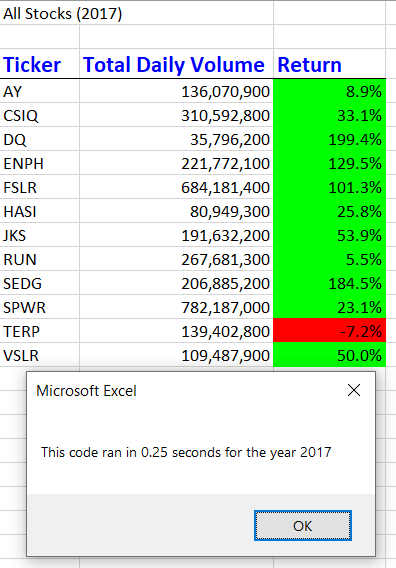
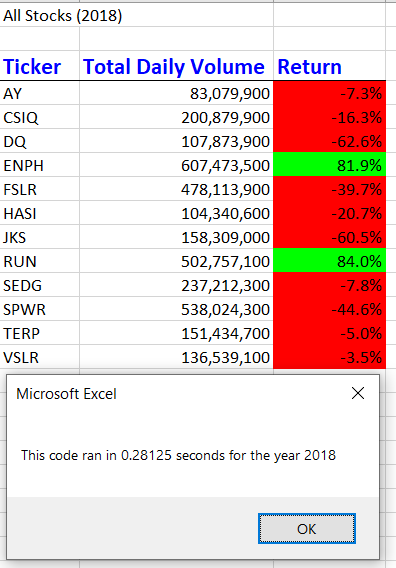
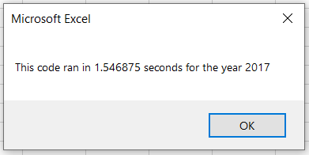
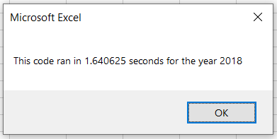

# VBA Challenge 

## Project Overview
The purpose of this project is to create a VBA Macro to evaluate green energy stocks across the stock market quickly and on an ongoing basis with few or no changes necessary. The analysis centers around the understanding of two key metrics; Total Daily Volume (trades) and  Yearly Return % for any given green energy stock. By understanding Total Daily Volume, one can better understand if the price value as a higher TDV will lead to more accurate value in current price. Evaluating the Yearly Return % is a quick way to understand at two given points in, what one's return would have been.

## Results 2017 vs 2018
Evaluating the stock results from 2017 and 2018, we can see that DQ is not a good choice to put all your funds into. While DQ led the way in Return % with 199.4% in 2017, the low trade volume may have led to an inflated value, resulting in a 62.4% decline in 2018. When considering other green energy stocks, TERP is the only one evaluated that declined in both 2017 and 2018, and as such should not likely be in consideration. ENPH, on the other hand, is the only stock to grow yearly returns in both years, and should lead the way when looking for other stocks to invest in rather than DQ.

 

---

## Summary of Refactoring
Refactoring code in general can significantly speed up run time, and also may simplify the code for easier future user understanding. By using fewer lines of code or by introducing variables or arrays that can limit duplicate looping, you can process the code much faster. While refactoring can save time, it is worth considering how often you'll be using the code and if the effort to refactor really matters. In the case of the VBA challenge, if we are only running this once per year, saving 1 second on run time is likely not a good reason to spend hours refactoring if the original code works.

As you see below, before being refactored the challenge code processed significantly slower (relative to the refactored times above). By introducing the tickerIndex and arrays, we declare everything we needed on one loop through the data rather than continuous loops for every ticker as previously done. Ultimately we didn't significantly reduce the code lines, or necessarily make the code much easier to understand for a new user or after not using the code for a while, but should we expand the use of this code to all stocks outside of green energy, the added efficiency would likely be useful.

 

```bash
Kyle Schneider, 9/13/2020
```
